PPOL 6802 Week 5 - Univariate Visualization
================
Alex Lundry
2025-08-29

Today we’ll be learning how to create visualizations in R and ggplot2 of
univariate data. For this demonstration we will be using the [Global
Power Plant
Database](https://datasets.wri.org/dataset/globalpowerplantdatabase).
Please go to the URL and download the data, and place it in an
accessible directory. Then open a new R script, load the libraries
you’ll be using and read the data into your R environment. Here’s how
you can do that:

``` r
# load necessary library
library(tidyverse)
```

    ## Warning: package 'ggplot2' was built under R version 4.3.3

    ## Warning: package 'purrr' was built under R version 4.3.3

    ## Warning: package 'lubridate' was built under R version 4.3.3

    ## ── Attaching core tidyverse packages ──────────────────────── tidyverse 2.0.0 ──
    ## ✔ dplyr     1.1.4     ✔ readr     2.1.5
    ## ✔ forcats   1.0.0     ✔ stringr   1.5.1
    ## ✔ ggplot2   3.5.2     ✔ tibble    3.2.1
    ## ✔ lubridate 1.9.4     ✔ tidyr     1.3.1
    ## ✔ purrr     1.0.4     
    ## ── Conflicts ────────────────────────────────────────── tidyverse_conflicts() ──
    ## ✖ dplyr::filter() masks stats::filter()
    ## ✖ dplyr::lag()    masks stats::lag()
    ## ℹ Use the conflicted package (<http://conflicted.r-lib.org/>) to force all conflicts to become errors

``` r
library(scales)
```

    ## Warning: package 'scales' was built under R version 4.3.3

    ## 
    ## Attaching package: 'scales'
    ## 
    ## The following object is masked from 'package:purrr':
    ## 
    ##     discard
    ## 
    ## The following object is masked from 'package:readr':
    ## 
    ##     col_factor

``` r
# load data
# the code below assumes that I put the file in 
# a folder called "datasets" that is in my working directory
# d1 <- read_csv("datasets/global_power_plant_database_v_1_3/global_power_plant_database.csv") 
# if you did not, then you will have to type out the full path, something like this:
d1 <- read_csv("global_power_plant_database_v_1_3/global_power_plant_database.csv")
```

    ## Warning: One or more parsing issues, call `problems()` on your data frame for details,
    ## e.g.:
    ##   dat <- vroom(...)
    ##   problems(dat)

    ## Rows: 34936 Columns: 36
    ## ── Column specification ────────────────────────────────────────────────────────
    ## Delimiter: ","
    ## chr (18): country, country_long, name, gppd_idnr, primary_fuel, other_fuel1,...
    ## dbl (17): capacity_mw, latitude, longitude, commissioning_year, year_of_capa...
    ## lgl  (1): other_fuel3
    ## 
    ## ℹ Use `spec()` to retrieve the full column specification for this data.
    ## ℹ Specify the column types or set `show_col_types = FALSE` to quiet this message.

## Dataset Overview

The first thing you should be doing with any dataset is exploring it.
You’ve no doubt already covered some of the basics of EDA (Exploratory
Data Analysis) in your Quant courses. But this is a visualization
course, so let’s consider how visualization can help. In fact, many of
the univariate plots we will make today will be directly helpful as an
exploratory tool.

Remember the two quotes we’ve previously discussed about the usefulness
of visualization to EDA:

> “The greatest value of a picture is when it forces us to notice what
> we never expected to see.” - John Tukey

> “Getting information from a table is like extracting sunbeams from a
> cucumber.” ~ Arthur & Henry Farquhar

We’ll begin with three basic commands that don’t qualify formally as
data visualization, but they certainly enable you to see the data more
easily:

- the tidyverse’s `glimpse` function.
- base R’s `head` function
- base R’s `View` function

Each of these can be used to better understand what the data looks like.
First, `glimpse` provides us with a succinct look at the row and column
count, each variable and it’s corresponding type, and a brief look at
the first few observations. Here it is for the powerplant dataset:

``` r
glimpse(d1)
```

    ## Rows: 34,936
    ## Columns: 36
    ## $ country                        <chr> "AFG", "AFG", "AFG", "AFG", "AFG", "AFG…
    ## $ country_long                   <chr> "Afghanistan", "Afghanistan", "Afghanis…
    ## $ name                           <chr> "Kajaki Hydroelectric Power Plant Afgha…
    ## $ gppd_idnr                      <chr> "GEODB0040538", "WKS0070144", "WKS00711…
    ## $ capacity_mw                    <dbl> 33.00, 10.00, 10.00, 66.00, 100.00, 11.…
    ## $ latitude                       <dbl> 32.3220, 31.6700, 31.6230, 34.5560, 34.…
    ## $ longitude                      <dbl> 65.1190, 65.7950, 65.7920, 69.4787, 69.…
    ## $ primary_fuel                   <chr> "Hydro", "Solar", "Solar", "Hydro", "Hy…
    ## $ other_fuel1                    <chr> NA, NA, NA, NA, NA, NA, NA, NA, NA, NA,…
    ## $ other_fuel2                    <chr> NA, NA, NA, NA, NA, NA, NA, NA, NA, NA,…
    ## $ other_fuel3                    <lgl> NA, NA, NA, NA, NA, NA, NA, NA, NA, NA,…
    ## $ commissioning_year             <dbl> NA, NA, NA, NA, NA, NA, NA, NA, NA, 196…
    ## $ owner                          <chr> NA, NA, NA, NA, NA, NA, NA, NA, NA, NA,…
    ## $ source                         <chr> "GEODB", "Wiki-Solar", "Wiki-Solar", "G…
    ## $ url                            <chr> "http://globalenergyobservatory.org", "…
    ## $ geolocation_source             <chr> "GEODB", "Wiki-Solar", "Wiki-Solar", "G…
    ## $ wepp_id                        <chr> "1009793", NA, NA, "1009795", "1009797"…
    ## $ year_of_capacity_data          <dbl> 2017, NA, NA, 2017, 2017, 2017, 2017, 2…
    ## $ generation_gwh_2013            <dbl> NA, NA, NA, NA, NA, NA, NA, NA, NA, NA,…
    ## $ generation_gwh_2014            <dbl> NA, NA, NA, NA, NA, NA, NA, NA, NA, NA,…
    ## $ generation_gwh_2015            <dbl> NA, NA, NA, NA, NA, NA, NA, NA, NA, NA,…
    ## $ generation_gwh_2016            <dbl> NA, NA, NA, NA, NA, NA, NA, NA, NA, NA,…
    ## $ generation_gwh_2017            <dbl> NA, NA, NA, NA, NA, NA, NA, NA, NA, NA,…
    ## $ generation_gwh_2018            <dbl> NA, NA, NA, NA, NA, NA, NA, NA, NA, NA,…
    ## $ generation_gwh_2019            <dbl> NA, NA, NA, NA, NA, NA, NA, NA, NA, NA,…
    ## $ generation_data_source         <chr> NA, NA, NA, NA, NA, NA, NA, NA, NA, NA,…
    ## $ estimated_generation_gwh_2013  <dbl> 123.77, 18.43, 18.64, 225.06, 406.16, 5…
    ## $ estimated_generation_gwh_2014  <dbl> 162.90, 17.48, 17.58, 203.55, 357.22, 5…
    ## $ estimated_generation_gwh_2015  <dbl> 97.39, 18.25, 19.10, 146.90, 270.99, 42…
    ## $ estimated_generation_gwh_2016  <dbl> 137.76, 17.70, 17.62, 230.18, 395.38, 5…
    ## $ estimated_generation_gwh_2017  <dbl> 119.50, 18.29, 18.72, 174.91, 350.80, 4…
    ## $ estimated_generation_note_2013 <chr> "HYDRO-V1", "SOLAR-V1-NO-AGE", "SOLAR-V…
    ## $ estimated_generation_note_2014 <chr> "HYDRO-V1", "SOLAR-V1-NO-AGE", "SOLAR-V…
    ## $ estimated_generation_note_2015 <chr> "HYDRO-V1", "SOLAR-V1-NO-AGE", "SOLAR-V…
    ## $ estimated_generation_note_2016 <chr> "HYDRO-V1", "SOLAR-V1-NO-AGE", "SOLAR-V…
    ## $ estimated_generation_note_2017 <chr> "HYDRO-V1", "SOLAR-V1-NO-AGE", "SOLAR-V…

We immediately see that the dataset has 34,936 rows and 36 columns
(variables). We see the type of variables (character, double, logical,
etc), and the first few rows of each variable.

Of course, sometimes you just want to literally look at the data, you
can do this a couple different ways. First, you can use `head()` to
display the first few records in the R console. It defaults to the first
5 if you don’t provide an `n =` parameter, but let’s show it in action
here:

``` r
head(d1, n = 10) # you don't need the n parameter; it defaults to n = 5
```

    ## # A tibble: 10 × 36
    ##    country country_long name            gppd_idnr capacity_mw latitude longitude
    ##    <chr>   <chr>        <chr>           <chr>           <dbl>    <dbl>     <dbl>
    ##  1 AFG     Afghanistan  Kajaki Hydroel… GEODB004…        33       32.3      65.1
    ##  2 AFG     Afghanistan  Kandahar DOG    WKS00701…        10       31.7      65.8
    ##  3 AFG     Afghanistan  Kandahar JOL    WKS00711…        10       31.6      65.8
    ##  4 AFG     Afghanistan  Mahipar Hydroe… GEODB004…        66       34.6      69.5
    ##  5 AFG     Afghanistan  Naghlu Dam Hyd… GEODB004…       100       34.6      69.7
    ##  6 AFG     Afghanistan  Nangarhar (Dar… GEODB004…        11.6     34.5      70.4
    ##  7 AFG     Afghanistan  Northwest Kabu… GEODB004…        42       34.6      69.1
    ##  8 AFG     Afghanistan  Pul-e-Khumri H… GEODB004…         6       35.9      68.7
    ##  9 AFG     Afghanistan  Sarobi Dam Hyd… GEODB004…        22       34.6      69.8
    ## 10 ALB     Albania      Bistrica 1      WRI10021…        27       39.9      20.1
    ## # ℹ 29 more variables: primary_fuel <chr>, other_fuel1 <chr>,
    ## #   other_fuel2 <chr>, other_fuel3 <lgl>, commissioning_year <dbl>,
    ## #   owner <chr>, source <chr>, url <chr>, geolocation_source <chr>,
    ## #   wepp_id <chr>, year_of_capacity_data <dbl>, generation_gwh_2013 <dbl>,
    ## #   generation_gwh_2014 <dbl>, generation_gwh_2015 <dbl>,
    ## #   generation_gwh_2016 <dbl>, generation_gwh_2017 <dbl>,
    ## #   generation_gwh_2018 <dbl>, generation_gwh_2019 <dbl>, …

You can also call the `View()` function, which opens the data in a new R
Studio tab in a format that mimics a typical spreadsheet, in which you
can sort and filter. I find this to be very helpful.

``` r
# I've commented out the View code call just because it screws things up 
# when you're in an R markdown file, which is what this is.  
# View(d1)
```

But, given that this is a visualization course, there is a more visual
way to get an overview of the data. I’ve found the `visdata` package to
be an extraordinarily useful tool to help me “see” the big picture of
large datasets:

``` r
# you'll need to uncomment the code below and run it in order to install this package
# if you're wondering why it looks different for this package, it's because this 
# isn't yet on the official R site, so we need to install it directly from github
# we can only do this using a function called install_github that is part of a 
# package called "devtools."  In fact, you will have to install the devtools package
# first in order to do this.

# install.packages("devtools")
# devtools::install_github("ropensci/visdat")
library(visdat)
```

In the `visdat` package the eponymous function is the most useful. Below
we call `vis_dat` but we are first piping a smaller dataset into it. If
we had just given it the full dataset it would throw an error and tell
us the dataset is too big and needs to be sampled:

``` r
d1 %>% 
  slice_sample(n = 10000) %>% 
  vis_dat()
```

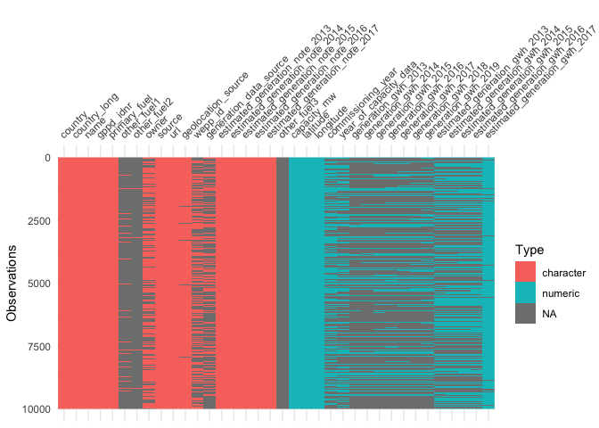<!-- -->

It visualizes the data set, showing where there is missing data and the
types of variables it has. Notice how it shows you that there are some
SIZEABLE gaps in the data. Looks like the generation data varies by the
year.

## Filtering the Data

With this information, let’s pare down the dataset to something a little
more manageable for this class session. We’ll filter to just the year
2019, and power plants in the United States and we’ll select just a few
key variables that look interesting and helpful. We can do this using
`dplyr` filter calls and saving this to a new dataset, named d2:

``` r
d2 <- d1 %>% 
  filter(country == "USA", 
         year_of_capacity_data == 2019) %>% 
  select(country:primary_fuel, commissioning_year:year_of_capacity_data, generation_gwh_2019)

glimpse(d2)
```

    ## Rows: 9,789
    ## Columns: 16
    ## $ country               <chr> "USA", "USA", "USA", "USA", "USA", "USA", "USA",…
    ## $ country_long          <chr> "United States of America", "United States of Am…
    ## $ name                  <chr> "100 Brook Hill Drive Solar", "1025 Traveller So…
    ## $ gppd_idnr             <chr> "USA0063292", "USA0062660", "USA0062661", "USA00…
    ## $ capacity_mw           <dbl> 2.0, 5.0, 3.0, 1.9, 2.0, 1.3, 3.8, 4.2, 1.3, 1.9…
    ## $ latitude              <dbl> 41.0930, 35.4273, 36.1971, 40.2003, 42.0761, 33.…
    ## $ longitude             <dbl> -73.9828, -79.1263, -80.8067, -74.5761, -71.4227…
    ## $ primary_fuel          <chr> "Solar", "Solar", "Solar", "Solar", "Solar", "So…
    ## $ commissioning_year    <dbl> 2016, 2019, 2019, 2012, 2012, 2011, 2011, 2000, …
    ## $ owner                 <chr> "Diamond Properties", "CI-II Mitchell Holding LL…
    ## $ source                <chr> "U.S. Energy Information Administration", "U.S. …
    ## $ url                   <chr> "http://www.eia.gov/electricity/data/browser/", …
    ## $ geolocation_source    <chr> "U.S. Energy Information Administration", "U.S. …
    ## $ wepp_id               <chr> NA, NA, NA, NA, NA, NA, "67644", "52308", NA, "6…
    ## $ year_of_capacity_data <dbl> 2019, 2019, 2019, 2019, 2019, 2019, 2019, 2019, …
    ## $ generation_gwh_2019   <dbl> 2.46700, 1.33200, 1.41700, 2.34900, 2.30300, 1.7…

## Visualizing One Categorical Variable

The most basic visualization task you will undertake will be the
visualization of just one variable - especially if it is a
straightforward categorical variable. Imagine, for example, visualizing
the gender distribution of a dataset. You’ll have only a few different
values to visualize!

First, let’s just remind ourselves which categorical variables we have
in the dataset to work with. The code below lists the names of columns
in the dataframe that are of the “character” data type. We don’t need to
dig into this deeply, but it’s helpful to know:

`sapply()` is a function that applies a specific function over a vector.
`class()` tells us the type of variable. `names()` will give us the
variable names of a dataset. `[]` the brackets allows us to select
specific parts of a vector.

The statement below essentially says:

1)  For each of the variables in d2 (sapply)
2)  check to see if the class is equal to character (class ==
    “character”)
3)  if it is a character, then return the name of the variable
    (names(d2)\[\])

``` r
names(d2)[sapply(d2, class) == "character"]
```

    ##  [1] "country"            "country_long"       "name"              
    ##  [4] "gppd_idnr"          "primary_fuel"       "owner"             
    ##  [7] "source"             "url"                "geolocation_source"
    ## [10] "wepp_id"

Looks like `primary_fuel` is our most interesting and useful one here.
Let’s take a look at it’s values and get a sense for the data we’d like
to display. We can do this by calling tidyverse’s `count` function, and
asking it to sort the data descending by that count:

``` r
count(d2, primary_fuel, sort = T)
```

    ## # A tibble: 14 × 2
    ##    primary_fuel     n
    ##    <chr>        <int>
    ##  1 Solar         3274
    ##  2 Gas           1809
    ##  3 Hydro         1438
    ##  4 Wind          1137
    ##  5 Oil            864
    ##  6 Waste          541
    ##  7 Coal           285
    ##  8 Biomass        153
    ##  9 Storage        104
    ## 10 Geothermal      65
    ## 11 Nuclear         58
    ## 12 Cogeneration    34
    ## 13 Other           16
    ## 14 Petcoke         11

We have 14 values of `primary_fuel` with Solar, Gas, Hydro and Wind
being the most common values. This is a great start to making our first
visualization.

### Bar Charts

The most basic visualization we can make for one categorical variable
would be to display the count of `primary_fuel` as a bar. But because it
is the most basic, that means it is highly versatile and one of the most
frequently used! As such, we are going to go into great detail on this.
It’s easy to make a bar chart, but improving it can get quite complex!
So let’s dig in here - we’ll start simple and then add complexity
step-by-step until we have an extremely robust bar chart.

To begin, remember your ggplot syntax! The only required items are:

- **data**, for which we will assign `d2`
- **aesthetic**, assigned here to `primary_fuel`
- **geom**, we are doing a bar

Now take a look at how we slot this into the ggplot call below - notice
that we are NOT explicitly declaring either the dataset or the X
aesthetic mapping here (remember that ggplot is really good at
understanding what you mean).

``` r
ggplot(d2, aes(primary_fuel)) +
  geom_bar()
```

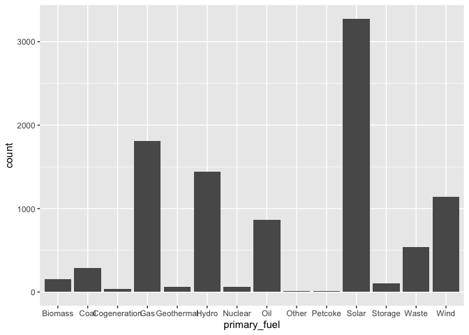<!-- -->

A good start, thanks to ggplot’s sensible defaults! Most importantly,
with geom_bar it is defaulting the **stat** call to “count” and simply
counting up the number of items for each primary_fuel category.

But there are many ways we can improve this, so let’s get to it. First,
and most obviously, let’s give these bars a meaningful sort, preferably
in order of the number of instances in the data.

How do we do this? Well, we could “bake an apple pie from scratch” OR we
could use an easily accessible function, in this case, a tidyverse
function called `fct_infreq()` which automatically turns categorical
variables into a factor (a special data type in R), that is put in
descending order based on its frequency in the dataset.

``` r
ggplot(d2, aes(x = fct_infreq(primary_fuel))) +
  geom_bar()
```

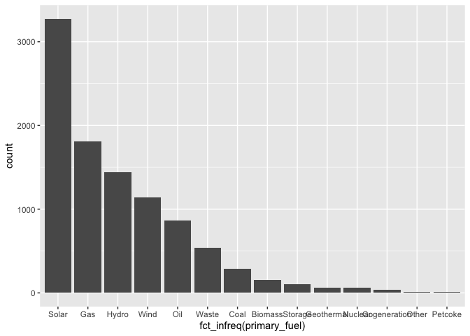<!-- -->

Love it. But those fuel type names are tight, in some cases overlapping,
making them unreadable. It would probably help to have this be a
horizontal bar chart. To do that we make a change to the coordinate
system. We call `coord_flip`:

``` r
ggplot(d2, aes(x = fct_infreq(primary_fuel))) +
  geom_bar() +
  coord_flip()
```

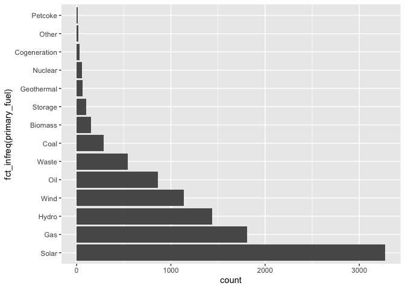<!-- -->

Better! But notice what that did to the ordering. In a typical bar
graph, you’ll want to sort largest to smallest from top to bottom. To do
this, we are going to add another similar tidyverse function, `fct_rev`
which reverses the ordering of a factor. To do this, we’ll pipe our
`fct_infreq` expression into the `fct_rev` function.

We can do this in the initial ggplot call within the aes parameter. It
would look like this:
`ggplot(d1, aes(x = fct_infreq(primary_fuel) %>% fct_rev()))`. But
frankly, when you do this it hurts the code’s legibility. So, from this
point onward, we are going to change up a key component of how we make
the plot. By changing this, it will make the code somewhat more complex,
but much easier to read and also easier to work with inside of our
ggplot syntax. Basically, instead of having ggplot calculate a frequency
table, we are going to do that ahead of time and then pipe that table
into ggplot.

Remember your basic tidyverse piping rules! First we take the dataset,
pipe that into a mutate statement to create the factor levels and then
reverse them, and then we are going to pipe that into a `count()`
function that will generate a frequency table, which is then piped into
ggplot. Like so:

``` r
d2 %>% 
  mutate(primary_fuel = fct_infreq(primary_fuel) %>% fct_rev()) %>% 
  count(primary_fuel)
```

    ## # A tibble: 14 × 2
    ##    primary_fuel     n
    ##    <fct>        <int>
    ##  1 Petcoke         11
    ##  2 Other           16
    ##  3 Cogeneration    34
    ##  4 Nuclear         58
    ##  5 Geothermal      65
    ##  6 Storage        104
    ##  7 Biomass        153
    ##  8 Coal           285
    ##  9 Waste          541
    ## 10 Oil            864
    ## 11 Wind          1137
    ## 12 Hydro         1438
    ## 13 Gas           1809
    ## 14 Solar         3274

Fine, but this then means we need to make two key changes to our ggplot
syntax:

1)  We change the aesthetic call. Originally we only needed an X
    aesthetic. Now we need have both an X mapping to `primary_fuel` and
    a Y mapping to new variable created by the count function, `n`.
2)  We must change the geom_bar function. Its default stat is `count`,
    but now we have already done the counting outside of ggplot, so we
    must tell it to use a different stat. When we do NOT want it to
    apply any statistical transformation and to simply display the
    number that’s in the data, we give it the stat **“identity.”**

``` r
d2 %>% 
  mutate(primary_fuel = fct_infreq(primary_fuel) %>% fct_rev()) %>% 
  count(primary_fuel) %>% 
  ggplot(aes(primary_fuel, n)) +
  geom_bar(stat = "identity") +
  coord_flip()
```

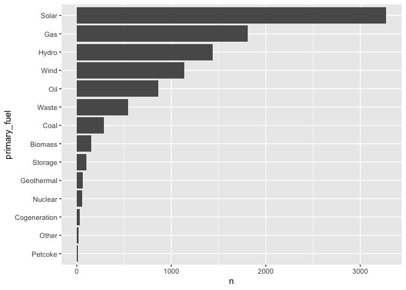<!-- -->

Excellent. Let’s add some more detail here. We’ll visually call out our
non-renewable sources that come from fossil fuels. Let’s create a new
variable called `fossil_fuels` that is either **TRUE** or **FALSE** and
then we’ll give our fossil fuels a different color. So take the data and
add that mutation to the piped tidyverse function. We then pipe that
into ggplot, but here, we add an `aes` call in the `geom_bar` function,
telling it to vary the fill aesthetic of the bar based on the value of
the fossil_fuels variable.

``` r
d2 %>% 
  mutate(primary_fuel = fct_infreq(primary_fuel) %>% fct_rev(),
         fossil_fuel = ifelse(primary_fuel %in% c("Coal", "Oil", "Petcoke"), TRUE, FALSE)) %>% 
  count(fossil_fuel, primary_fuel) %>% 
  ggplot(aes(primary_fuel, n, fill = fossil_fuel)) +
  geom_bar(stat = "identity") +
  coord_flip()
```

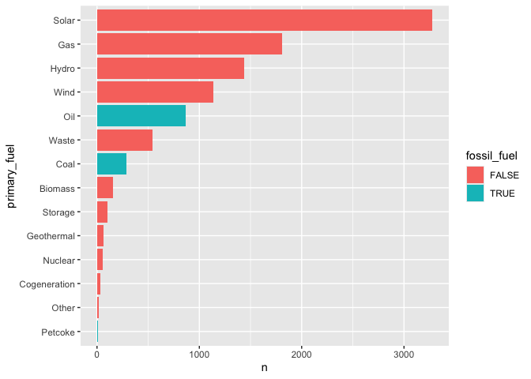<!-- -->

Nice - there’s one thing I don’t like about this though. We are now
duplicating code that we had previously - all that mutation business.
Best practice in these instances is to assign that to an object that we
can then call in the future, making your code much easier to read.

``` r
p1 <- d2 %>% 
  mutate(primary_fuel = fct_infreq(primary_fuel) %>% fct_rev(),
         fossil_fuel = ifelse(primary_fuel %in% c("Coal", "Oil", "Petcoke"), TRUE, FALSE)) %>% 
  count(fossil_fuel, primary_fuel)

p1 %>% 
  ggplot(aes(primary_fuel, n, fill = fossil_fuel)) +
  geom_bar(stat = "identity") +
  coord_flip()
```

<!-- -->

Love it. But let’s change the colors up - the pink and blue aren’t
really helping us convey any useful information. We can change them by
adding a `scale` adjustment for the fill aesthetic. We’ll designate the
colors manually instead of relying on a built-in color palette, and
we’ll choose black and green to represent fossil fuels versus non-fossil
fuels .

``` r
p1 %>% 
  ggplot(aes(primary_fuel, n, fill = fossil_fuel)) +
  geom_bar(stat = "identity") +
  coord_flip() +
  scale_fill_manual(values = c("black", "green"))
```

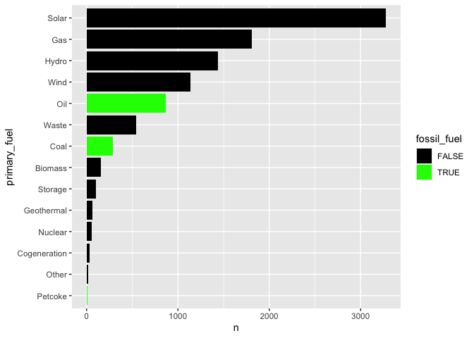<!-- -->

Better, but problematic, because our fossil fuels are colored green and
we certainly don’t associate fossil fuels with the color green! (Always
use color meaningfully!). The reason it did that is because when you are
manually assigning fill values it will assign them in the order of the
factored variable. In this case, since we did not specify the factor
order when we created it, it defaults to alphabetical order. We could
simply swap them in our code, but instead, we can just explicitly assign
them in our `scale_fill_manual` call:

``` r
p1 %>% 
  ggplot(aes(primary_fuel, n, fill = fossil_fuel)) +
  geom_bar(stat = "identity") +
  coord_flip() +
  scale_fill_manual(values = c("TRUE" = "black", "FALSE" = "green"))
```

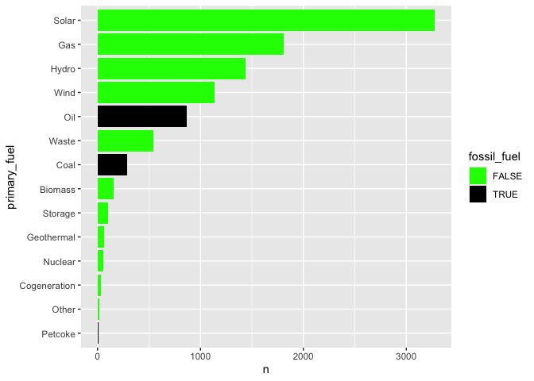<!-- -->

Much better, though that’s a terrible neon green - we’ll fix that in our
next go around.

What is still left to improve? The text. We aren’t being told much about
the chart. Let’s add a `labs` function and label the title, both axes,
and the legend. It is quite straightforward:

``` r
p1 %>% 
  ggplot(aes(primary_fuel, n, fill = fossil_fuel)) +
  geom_bar(stat = "identity") +
  coord_flip() +
  scale_fill_manual(values = c("TRUE" = "grey", "FALSE" = "lightgreen")) +
  labs(title = "Count of US Power Plants by Fuel Type",
       x = "N",
       y  = "",
       fill = "Fossil Fuel")
```

<!-- -->

Before we move on, notice something weird here? The labels x and y
didn’t act like they were flipped. Even though the `coord_flip` happens
earlier, we still had to label as though it was based on the original
ggplot call. This can get confusing, so I would suggest making the
`coord_flip` one of the last things you do:

``` r
p1 %>% 
  ggplot(aes(primary_fuel, n, fill = fossil_fuel)) +
  geom_bar(stat = "identity") +
  scale_fill_manual(values = c("TRUE" = "grey", "FALSE" = "lightgreen")) +
  labs(title = "Count of US Power Plants by Fuel Type",
       x = "",
       y  = "N",
       fill = "Fossil Fuel") +
    coord_flip()
```

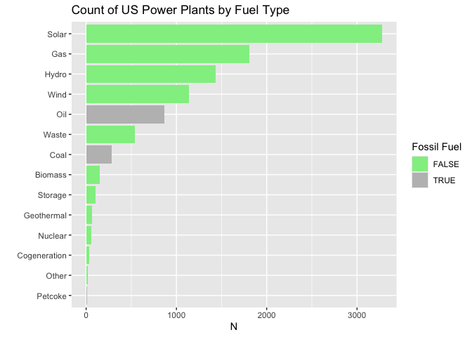<!-- -->

This is really coming together! It would be even better if we could
label the actual bars with their values. To do so means adding a new
geom, in this case `geom_text`. We want to add text to the visualization
that will vary based on the `primary_fuel` and the `n` value. We add a
new line of `geom_text` and we need to give it an aesthetic; for this
particular geom we must designate the `label` aesthetic. We do NOT need
to tell it the X aesthetic mapping since it is inheriting it from the
initial ggplot call.

``` r
p1 %>% 
  ggplot(aes(primary_fuel, n, fill = fossil_fuel)) +
  geom_bar(stat = "identity") +
  geom_text(aes(label = n)) +
  scale_fill_manual(values = c("TRUE" = "grey", "FALSE" = "lightgreen")) +
  labs(title = "Count of US Power Plants by Fuel Type",
       x = "",
       y  = "N",
       fill = "Fossil Fuel") +
    coord_flip()
```

<!-- -->

These need some cleaning up. I see two ways to clean these up:

1)  **Add commas where appropriate to the X axis labels and to the bar
    labels.** We do this by adding a call to the scale function inside
    of geom_text and for the continuous y axis. We call a function from
    the `scales` package that makes it easier to label things
    appropriately. When we want to reformat a vector of numbers like in
    our geom_text call, we use the `comma()` function (or `percent()` if
    you want to format it as a percentage). But when we want to format
    an axis, we have to use a slightly different function called
    `label_comma()` (or `label_percent()`).
2)  **Reposition the bar labels so they don’t overlap the ends of the
    bars.** To do this, you should rely on the `hjust` parameter in your
    `geom_text` call - it stands for horizontal adjustment and a value
    of 1 will put it at the right most edge of the bar, a value of 0.1
    will put it just to the right of the bar. Why? Honestly, I’ve never
    gotten a good answer on this. My hjust’s always need trial and error
    to get them where I want them to be.
3)  **Reposition the bar labels so that they vary based on the length of
    the bars.**. Because the height of the bars varies so dramatically,
    we need to vary where they labels go. I’m going to do this with some
    trickery in the form of `ifelse()` statements and multiple
    `geom_text` calls. For bars that are greater than 1000, I’m having
    it do `hjust = 1`, and if below 1000, the `hjust = 0.1`

``` r
p1 %>% 
  ggplot(aes(primary_fuel, n, fill = fossil_fuel)) +
  geom_bar(stat = "identity") +
  geom_text(aes(label = ifelse(n > 1000, comma(n), "")), hjust = 1) +
  geom_text(aes(label = ifelse(n < 1000, comma(n), "")), hjust = 0.1) +
  scale_fill_manual(values = c("TRUE" = "grey", "FALSE" = "lightgreen")) +
  scale_y_continuous(labels = label_comma()) +
  labs(title = "Count of US Power Plants by Fuel Type",
       x = "",
       y  = "N",
       fill = "Fossil Fuel") +
    coord_flip()
```

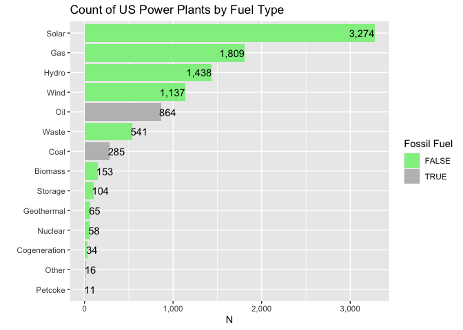<!-- -->

------------------------------------------------------------------------

*(Going back and reading this, I’m not very happy with my lack of detail
on hjust, so here’s some more context…)*

**What is “hjust”?** *hjust stands for horizontal justification. It
controls the horizontal alignment of text elements relative to their
specified position (e.g., left, center, right alignment). In ggplot2,
hjust values range from 0 to 1, where:*

- *0 aligns the text to the left (or start) of the specified position.*
- *0.5 centers the text on the specified position. 1 aligns the text to
  the right (or end) of the specified position.*
- *Values outside 0 to 1 are permissible, causing the text to align
  beyond the immediate start or end points relative to the positioning
  point.*

*In the above code, there are two geom_text layers used to add labels to
the bars, differentiated by the size of the value n:*

- *For large numbers (n \> 1000): hjust = 1 is used, meaning the text
  labels for large numbers are right-aligned with their specified
  position on the bars. This typically places these labels at the end
  (right side) of the bars when using coord_flip(), making it clear and
  avoiding overlap with the bar itself or other labels.*
- *For smaller numbers (n \< 1000): hjust = 0.1 is slightly off from a
  strict left alignment (0), nudging the labels a bit to the right from
  the start of the bars. This subtle adjustment helps in placing these
  smaller labels inside or just at the beginning of the bars, ensuring
  they are readable and visually distinct from labels for larger
  numbers.*

------------------------------------------------------------------------

That’s a good looking bar chart!

Finally, now that we’ve got a really good bar chart, let’s assume that
we’ve been asked to show this data not as raw counts but as a
percentages of all US power plants. We’ll pre-calculate this number
outside of ggplot by adding an `n()` function call to our count
statement.

``` r
p2 <- d2 %>% 
  mutate(primary_fuel = fct_infreq(primary_fuel) %>% fct_rev(),
         fossil_fuel = ifelse(primary_fuel %in% c("Coal", "Oil", "Petcoke"), TRUE, FALSE)) %>% 
  count(fossil_fuel, primary_fuel, total = n()) %>% 
  mutate(pct = round(n / total, 2))

p2
```

    ## # A tibble: 14 × 5
    ##    fossil_fuel primary_fuel total     n   pct
    ##    <lgl>       <fct>        <int> <int> <dbl>
    ##  1 FALSE       Other         9789    16  0   
    ##  2 FALSE       Cogeneration  9789    34  0   
    ##  3 FALSE       Nuclear       9789    58  0.01
    ##  4 FALSE       Geothermal    9789    65  0.01
    ##  5 FALSE       Storage       9789   104  0.01
    ##  6 FALSE       Biomass       9789   153  0.02
    ##  7 FALSE       Waste         9789   541  0.06
    ##  8 FALSE       Wind          9789  1137  0.12
    ##  9 FALSE       Hydro         9789  1438  0.15
    ## 10 FALSE       Gas           9789  1809  0.18
    ## 11 FALSE       Solar         9789  3274  0.33
    ## 12 TRUE        Petcoke       9789    11  0   
    ## 13 TRUE        Coal          9789   285  0.03
    ## 14 TRUE        Oil           9789   864  0.09

Then in ggplot, we simply change the assignment of the y variable in our
initial call, and also the aesthetic mapping in our `geom_text`. We’ll
also need to change our number formatting to percentages.

``` r
p2 %>% 
  ggplot(aes(primary_fuel, pct, fill = fossil_fuel)) +
  geom_bar(stat = "identity") +
  geom_text(aes(label = ifelse(pct > .01, percent(pct), "")), hjust = 1) +
  geom_text(aes(label = ifelse(pct <= .01, percent(pct), "")), hjust = 0.1) +
  scale_fill_manual(values = c("TRUE" = "grey", "FALSE" = "lightgreen")) +
  scale_y_continuous(labels = label_percent()) +
  labs(title = "Count of US Power Plants by Fuel Type",
       x = "",
       y  = "N",
       fill = "Fossil Fuel") +
    coord_flip()
```

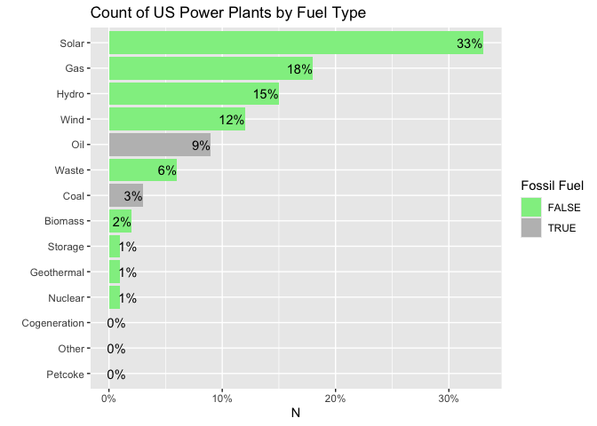<!-- -->

Well done! You now know how to make a fantastic looking bar chart.

### Pie Charts

After the bar, the other most common way to plot a single categorical
variable is the much derided pie chart. As we’ve discussed I believe the
pie chart can be useful so long as there are 3 or fewer categories, so
for this demonstration let’s visualize the distribution of fossil fuel
power plants in the US.

I’m sure you’ve never thought about this before, but pie charts are
actually just bar charts, but using a polar coordinate system. Let me
show you, by first making a bar chart of the data we are interested in.

``` r
pie1 <- d2 %>% 
  mutate(fossil_fuel = ifelse(primary_fuel %in% c("Coal", "Oil", "Petcoke"), TRUE, FALSE)) %>% 
  count(fossil_fuel) %>% 
  ggplot(aes(x = "", y = n, fill = fossil_fuel)) +
  geom_bar(stat = "identity") +
  scale_fill_manual(values = c("TRUE" = "grey", "FALSE" = "lightgreen"))


pie1
```

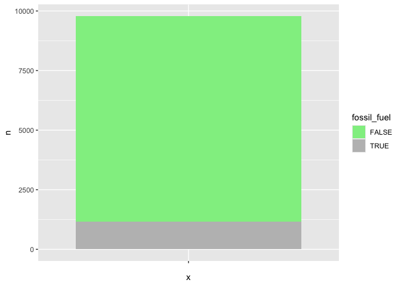<!-- -->

No surprises here. But now, let’s simply take that bar chart and convert
the coordinates to polar using `coord_polar`. I’ve also added a
`theme_void` call because without it the default gives you some weird
lines and shading (try it with that removed if you don’t believe me).

``` r
pie2 <- pie1 +
   coord_polar("y", start = 0) + 
   theme_void()

pie2
```

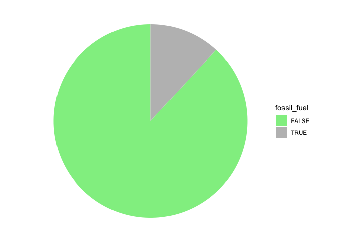<!-- -->

Let’s clean this up with some labels. In order to make this a little
easier, below I changed the fossil_fuel mutate statement so that instead
of TRUE and FALSE values, I’m just giving them the labels I’ll want in
the plot. This means I need to also change the scale_fill_manual call.

But the big change is the geom_text line. Notice that I’m using string
concatenation (`str_c()`) to put the values and the category labels
together. I’m doing that within the aesthetic call because it will vary
depending upon what we are visualizing. But outside of the aesthetic
call, I’m assigning all of the labels the color white, setting their
size to 4 and then using a new parameter called position. This tells the
text call where to put the text, in this case telling it to stack the
text and put it in the middle of the bar (or in this case, wedge) -
`vjust` means vertically justify it in the center (halfway between 0 and
1). (This might make more sense if you remember that it still thinks
it’s a bar chart at this point).

``` r
d1 %>% 
  mutate(fossil_fuel = ifelse(primary_fuel %in% c("Coal", "Oil", "Petcoke"), "Fossil Fuels", "Non-Fossil Fuels")) %>% 
  count(fossil_fuel) %>% 
  ggplot(aes(x = "", y = n, fill = fossil_fuel)) +
  geom_bar(stat = "identity") +
  scale_fill_manual(values = c("Fossil Fuels" = "grey", "Non-Fossil Fuels" = "lightgreen")) +
  labs(title = "US Power Plants by Fuel Type") +
  geom_text(aes(label = str_c(fossil_fuel, "\n", comma(n))), color = "white", size = 4, 
            position = position_stack(vjust = 0.5)) +
  coord_polar(theta = "y") +
  theme_void() +
  theme(legend.position = "none")
```

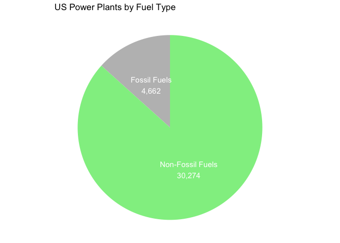<!-- -->

### Waffle Charts

Don’t eat dessert? How about breakfast? Here’s a quick look at the pie
chart’s sibling, the waffle chart. These are especially helpful when you
want to show frequencies at a scale that’s more human comprehensible. In
other words, I prefer these for when I want the user to think in terms
of raw numbers rather than proportions or percentages (even if I want
them thinking X out of 100). You may have seen visualizations like this
before:

- If the world were 100 people, 15 of them would be X.
- A viz where each square represents 1000 liters.

There is a special library for this that you’ll first have to install,
and then load called `waffle`. Once we have that, the key thing we’ll
need to do is figure out how we want to scale our data for the
visualization.

Let’s visualize the number of fossil fuel plants in the US compared to
the non-fossil fuel plants. To do this, we’ll create a waffle chart
where each square = 100 power plants. That will be our scale factor, by
which we will divide our count of power plants.

Once we have that we’ll call `geom_waffle` and designate the number of
rows = 10 Why 10? Well, with the 100 scale factor, there will be a total
of 98 boxes to visualize. By picking 10, it will get us the closest to
having a square 10x10 plot. I’m setting `flip = T` so that the variables
fill from bottom to top rather than left to right. We add a few other
parameter calls on size and color, and then add a subtitle label which
indicates “1 square = 100 Power Plants” and we are good to go!

``` r
# install.packages("waffle")
library(waffle)

scale_factor <- 100  # Adjust the scale factor as needed

d2 %>% 
  mutate(fossil_fuel = ifelse(primary_fuel %in% c("Coal", "Oil", "Petcoke"), "Fossil Fuels", "Non-Fossil Fuels")) %>% 
  count(fossil_fuel) %>%
  mutate(scaled_count = round(n / scale_factor)) %>%
  ggplot(aes(fill = fossil_fuel, values = scaled_count)) +
  geom_waffle(
    n_rows = 10,
    size = 0.33, 
    colour = "white",
    flip = T
  ) +
  coord_equal() +
  theme_void() +
  labs(title = "US Power Plants by Fuel Type",
       subtitle = "1 square = 100 Power Plants",
       fill = "Fossil Fuels")
```

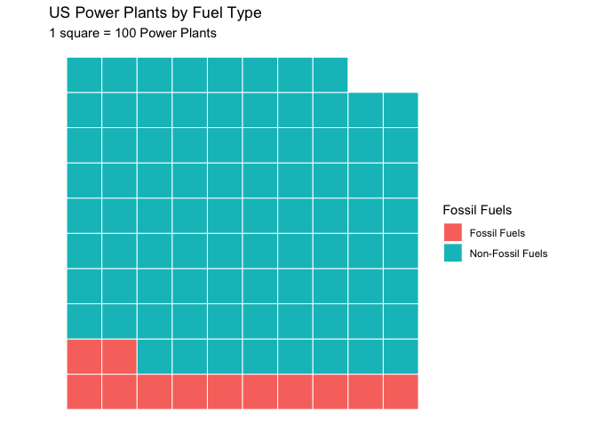<!-- -->

### Tree Map

An alternative to a pie chart and a waffle chart is a tree map. Unlike
pie charts, but like a waffle chart, it can handle categorical variables
that have many levels. Here again, we have a dedicated library that can
be used to easily create one, `treemapify` with the associated
`geom_treemap`. This can be used with either raw counts or percentages -
below we’ll use percentages.

``` r
library(treemapify)

d2 %>% 
  mutate(primary_fuel = fct_infreq(primary_fuel) %>% fct_rev(),
         fossil_fuel = ifelse(primary_fuel %in% c("Coal", "Oil", "Petcoke"), TRUE, FALSE)) %>% 
  count(fossil_fuel, primary_fuel, total = n()) %>% 
  mutate(pct = n / total) %>% 
  ggplot(aes(fill = primary_fuel, area = pct)) +
  geom_treemap() + 
  labs(title = "Power Plants by Fuel Type") 
```

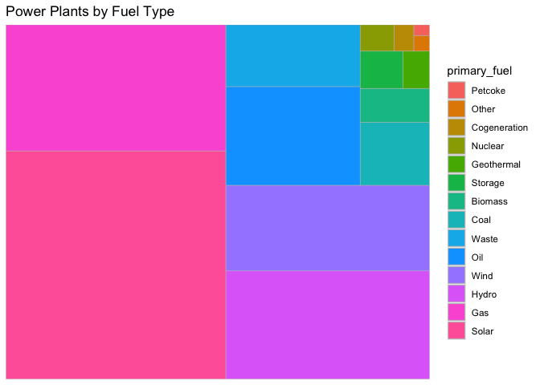<!-- -->

This is interesting, but without any direct labeling on the chart, this
is as bad as an overloaded pie chart. Here is a much more useful version
with labels, in which we can see it’s superiority to a pie chart. Notice
the concatenation I’m doing in the `geom_treemap_text` call to get the
label displaying exactly what I want:

``` r
d2 %>% 
  mutate(primary_fuel = fct_infreq(primary_fuel) %>% fct_rev(),
         fossil_fuel = ifelse(primary_fuel %in% c("Coal", "Oil", "Petcoke"), TRUE, FALSE)) %>% 
  count(fossil_fuel, primary_fuel, total = n()) %>% 
  mutate(pct = round(100 *(n / total), 1)) %>% 
  ggplot(aes(fill = primary_fuel, area = pct)) +
  geom_treemap() + 
  geom_treemap_text(aes(label = str_c(primary_fuel, " ", pct, "%")), color = "white", 
                    place = "center", reflow = T) +
  labs(title = "Power Plants by Fuel Type") +
  theme(legend.position = "none")
```

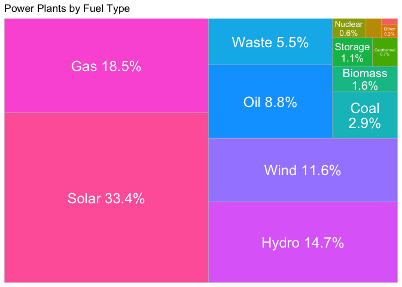<!-- -->

## Variable Understanding: Continuous Variables

Now let’s focus on understanding our continuous variables. Let’s see
what we have available to us by going back to that sapply function, but
look specifically for numeric variables:

``` r
names(d2)[sapply(d2, class) == "numeric"]
```

    ## [1] "capacity_mw"           "latitude"              "longitude"            
    ## [4] "commissioning_year"    "year_of_capacity_data" "generation_gwh_2019"

The `capacity_mw` and `generation_gwh_2019` look to be the most
interesting - how much can the plant generate and how much did it
actually generate in 2019? Let’s focus our investigation on the former.

### Histogram

The simplest visualization for a numeric variable and indeed the one
that is most helpful when we are doing exploratory data analysis is the
histogram. A histogram divides the x-axis into equally spaced bins and
then uses the height of a bar to display the number of observations that
fall in each bin.

Creating one is simple - you set the X aesthetic (undeclared) to
`capacity_mw` and then you call `geom_histogram`:

``` r
ggplot(d2, aes(capacity_mw)) +
   geom_histogram()
```

    ## `stat_bin()` using `bins = 30`. Pick better value with `binwidth`.

<!-- -->

The tallest bar shows that roughly 8000 observations are clustered
around the lowest possible MW capacity. This is likely a function of how
many different types of power plants there are in the dataset, covering
everything from very tiny solar arrays to massive nuclear stations.
Let’s get something more useful by filtering to a specific type of fuel:

``` r
d2 %>% 
  filter(primary_fuel == "Wind") %>% 
  ggplot(aes(capacity_mw)) +
  geom_histogram()
```

    ## `stat_bin()` using `bins = 30`. Pick better value with `binwidth`.

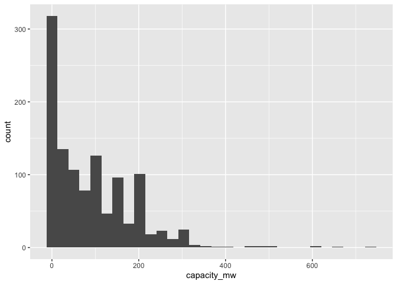<!-- -->

Looking at just wind farms, we have a much more interesting and useful
visualization. Note that the histogram defaulted to 30 “bins” of the
data. You can rerun the histogram with a different number of bins OR you
can designate the bin width. This could really change the “look” of the
data, so you should always try a bunch of different bin numbers or bin
widths, because it could reveal different patterns. Let’s look for a
“smoother” shape by having the histogram split the wind farms into
deciles, telling it to give us only 10 bins.

``` r
d2 %>% 
  filter(primary_fuel == "Wind") %>% 
  ggplot(aes(capacity_mw)) +
   geom_histogram(bins = 10)
```

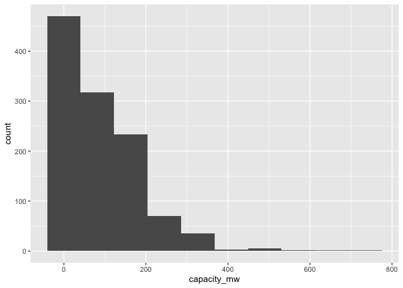<!-- -->

You can of course clean these up if you like, working the `lab` function
and changing some of the colors and or labels. But especially when you
are just using these for EDA, you won’t have any cause to make big
formatting changes.

### Density Plot

If we really are looking for a “smoother” visualization we can just turn
this into a density plot, which is in essence a smoothed version of a
histogram where the area under the curve equals one. This is most useful
as an alternative to the histogram for continuous data that comes from
an underlying smooth distribution.

Changing this to a density plot is as easy as changing the geom, and if
you like you can give it a fill color.

``` r
d2 %>% 
  filter(primary_fuel == "Wind") %>% 
  ggplot(aes(capacity_mw)) +
   geom_density(fill = "green")
```

<!-- -->

### Boxplots

Looking for something nerdier? Something a little more information
dense? Boxplots are odd, but can be incredibly useful (invented by
Tukey, remember). Here’s a great description of how they work. The box
itself represents the interquartile range, running from the 25th %tile
to the 75th %tile, with the bar in the middle representing the median.
The whiskers extend out to the farthest non-outlier point. And outliers
are shown as dots.


Creating one means changing the geom to `geom_boxplot` but keeping the
aesthetic statement the same. I’ve also called `coord_flip` below
because to my eyes having the boxplot run vertically is just a more
intuitive way to look at the plot than horizontal. But that’s just a
personal preference.

``` r
d2 %>% 
  filter(primary_fuel == "Wind") %>% 
  ggplot(aes(capacity_mw)) +
  geom_boxplot() +
  coord_flip()
```

<!-- -->

Boxplots are rarely used when communicating results to those with no
statistical background; you’ll mostly be using them for EDA.

### Dotplots

Finally, dotplots are sort of the hybrid between a waffle chart and a
histogram, in which each dot has a spot on the X axis designated by
numeric data, and the dots are stacked, with each dot representing one
observation. Think of 538’s Senate prediction
\[plots\]<https://projects.fivethirtyeight.com/2022-election-forecast/senate/>

They can be used to great effect when you have a limited number of
observations for a numeric variable. Consider the example below, in
which we take the full global dataset and count the number of nuclear
power plants that each country has. We then display a dotplot of the
number of countries that are at each count of nuclear plants (1, 2, 3,
etc).

This is done with `geom_dotplot` and a few fixed parameters to give it
some visual interest. I’m removing everything to do with the y axis
because as the help article says for this geom:

> When binning along the x axis and stacking along the y axis, the
> numbers on y axis are not meaningful, due to technical limitations of
> ggplot2. You can hide the y axis, as in one of the examples, or
> manually scale it to match the number of dots.

``` r
d1 %>% 
  filter(primary_fuel == "Nuclear") %>% 
  count(country, sort = T) %>% 
  ggplot(aes(n)) +
  geom_dotplot(fill = "darkred", color = "black") +
  labs(title = "Nuclear Power Plants per Country",
       x = "Number of Nuclear Power Plants") +
  theme(
    axis.title.y = element_blank(),
    axis.text.y = element_blank(),
    axis.ticks.y = element_blank(),
    legend.position = "none"
  )
```

    ## Bin width defaults to 1/30 of the range of the data. Pick better value with
    ## `binwidth`.

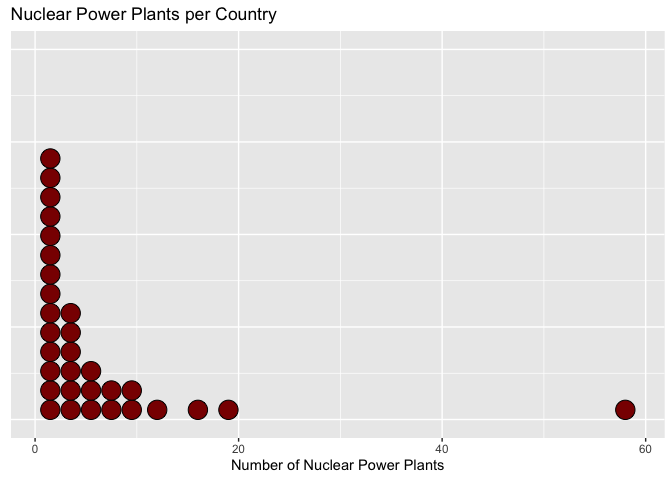<!-- -->

There is also a parameter option where you can set `stackdir = center`
that gives the visualization some added visual interest:

``` r
d1 %>% 
  filter(primary_fuel == "Nuclear") %>% 
  count(country) %>% 
  ggplot(aes(n)) +
  geom_dotplot(stackdir = "center", fill = "darkred", color = "black") +
  labs(title = "Nuclear Power Plants per Country",
       x = "Number of Nuclear Power Plants") +
  theme(
    axis.title.y = element_blank(),
    axis.text.y = element_blank(),
    axis.ticks.y = element_blank(),
    legend.position = "none"
  )
```

    ## Bin width defaults to 1/30 of the range of the data. Pick better value with
    ## `binwidth`.

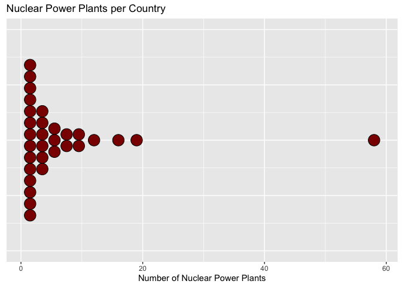<!-- -->
